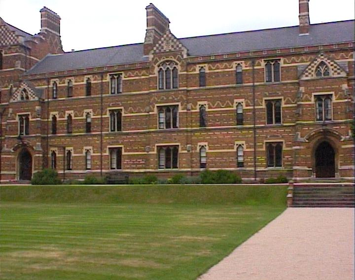
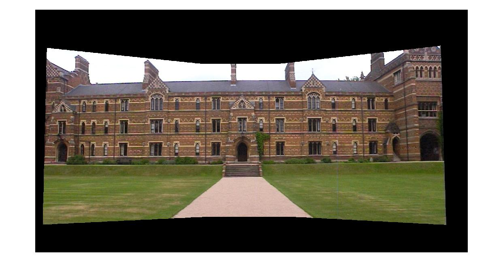

# cv_panorama
Use harris corner detector as local features, and SIFT descriptor to produce 128-dimensional descriptor around each feature point. Then find the correspondance points by calculating distance of descriptor between two images. Finally, estimate the homography by solving set of linear equations using RANSAC algorithm.   

original image:  

panorama:  
